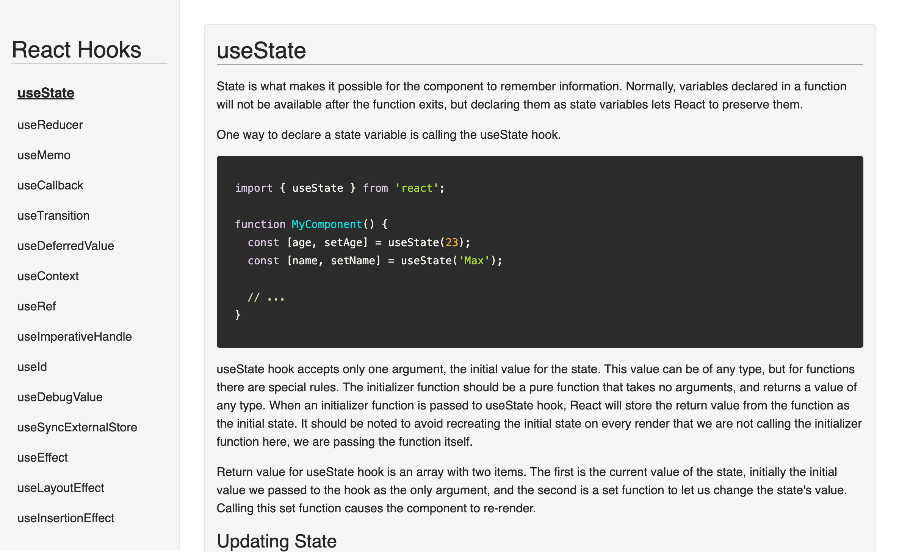

# React Hooks

This basic React app contains an explanation page for every built-in React hook. Pages can be navigated to from the menu.

### To run the app in the development mode:

Run 'npm start' in the project directory. Open [http://localhost:3000](http://localhost:3000) in your browser to view the app.
